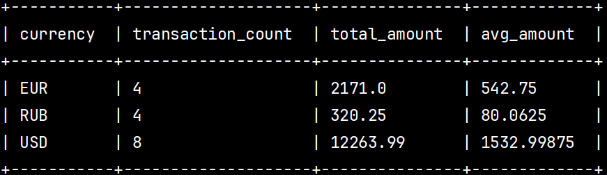
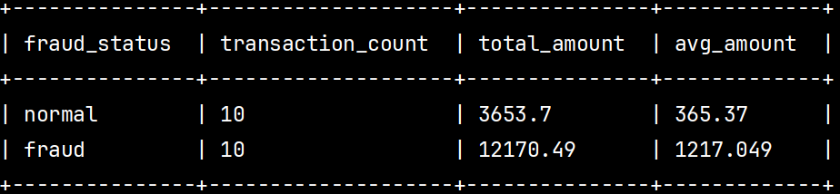
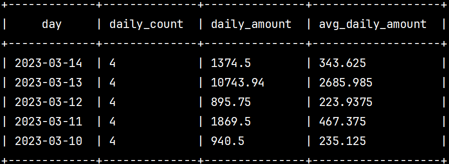
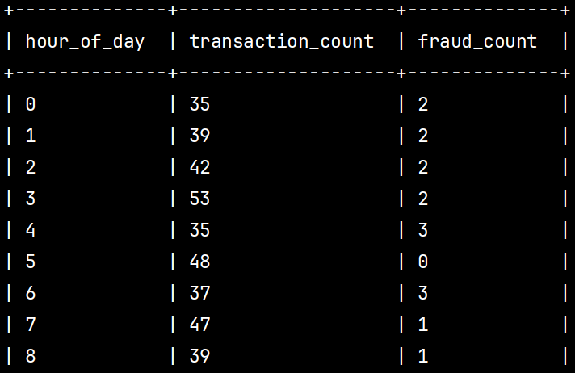
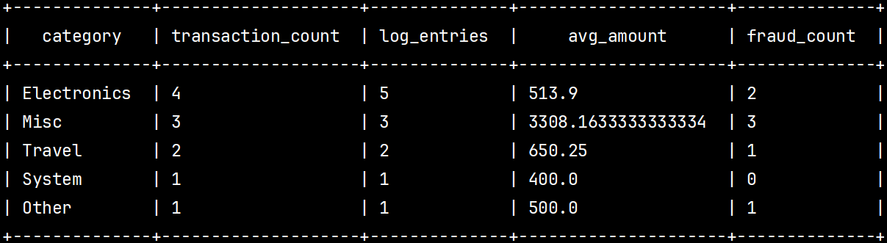
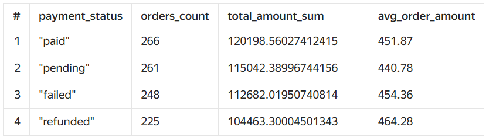
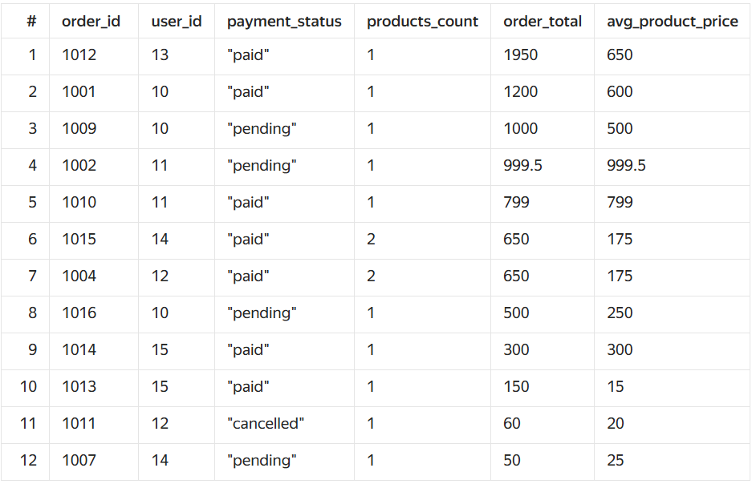
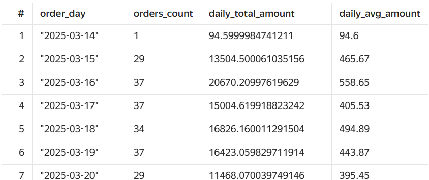
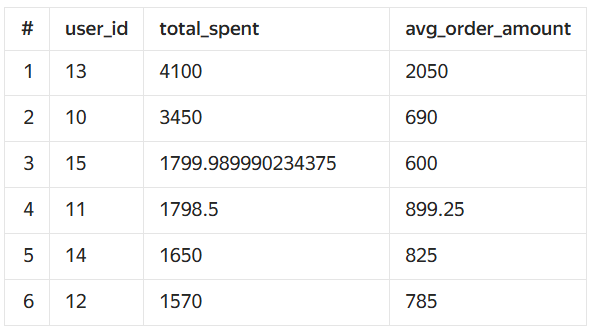
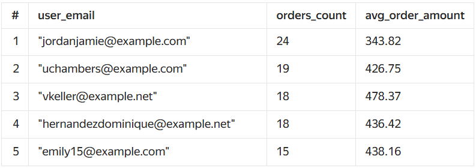

# Проверочное задание.
## Тема - Обработка и анализ данных в Yandex Cloud: от загрузки до визуализации

## 📁 Структура проекта

```bash
.
├── task1/                  # Работа с Yandex Data Proc и Hive/Spark
│   ├── init_tables.hql     # Создание таблиц Hive
│   ├── aggregation_queries.hql  # Аналитические запросы
│   ├── generate_data.py    # Генерация данных transactions_v2.csv и logs_v2.txt
│   ├── main.tf             # Развёртывание Data Proc кластера с помощью Terraform
│   └── variables.tf        # Переменные для Terraform
│
├── task2/                  # Работа с ClickHouse
│   ├── init_tables.sql     # Создание таблиц с движком S3
│   ├── aggregation_queries.sql  # Аналитические запросы
│   ├── generate_data.py    # Генерация данных orders.csv и order_items.csv
│   ├── main.tf             # Развёртывание ClickHouse с помощью Terraform
│   └── variables.tf        # Переменные для Terraform
```

---

## 📌 Задание 1: Yandex Data Proc + Hive/Spark

**🗂 Таблицы:**
- `transactions_v2`
- `logs_v2`

**📥 Источник данных:**
TXT и CSV файлы, размещённые в Object Storage

**🛠️ Скрипты:**
- [init_tables.hql](task1/init_tables.hql) — создание таблиц
- [aggregation_queries.hql](task1/aggregation_queries.hql) — аналитические запросы

**🖼 Скриншоты результатов:**
| № | Описание запроса                                                                 | Скриншот |
|---|-----------------------------------------------------------------------------------|----------|
| 1 | Фильтрация по валютам и агрегирование                                            |  |
| 2 | Подсчёт мошеннических/нормальных транзакций                                      |  |
| 3 | Ежедневная статистика                                                            |  |
| 4 | Анализ по времени суток                                                          |  |
| 5 | JOIN с логами, топ категории, частота и сумма                                   |  |

---

## 📌 Задание 2: ClickHouse

**🗂 Таблицы:**
- `orders`
- `order_items`

**📥 Источник данных:**
TXT и CSV файлы, размещённые в Object Storage

**🛠️ Скрипты:**
- [init_tables.sql](task2/init_tables.sql) — создание таблиц
- [aggregation_queries.sql](task2/aggregation_queries.sql) — аналитические SQL-запросы

**🖼 Скриншоты результатов:**
| № | Описание запроса                                                             | Скриншот |
|---|------------------------------------------------------------------------------|----------|
| 1 | Группировка по `payment_status`                                              |  |
| 2 | JOIN с `order_items`, агрегации по скидкам, количеству и суммам              |  |
| 3 | Ежедневная статистика заказов                                                |  |
| 4.1 | Топ пользователей по сумме заказов                                         |  |
| 4.2 | Топ пользователей по количеству заказов                                    |  |

---

## 🚀 Развёртывание

Для развёртывания ресурсов в Yandex Cloud используется [Tofu (ex-Terraform)](https://opentofu.org/):

```bash
cd task1/
tofu init
tofu apply

cd ../task2/
tofu init
tofu apply
```

---

## 🧪 Генерация данных

Скрипты `generate_data.py` в каждой задаче позволяют сгенерировать необходимые CSV и TXT файлы для загрузки в Object Storage.

Пример запуска:

```bash
python generate_data.py
```
