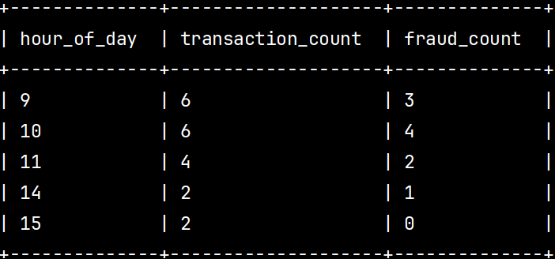

# Проверочное задание.
## Тема - Обработка и анализ данных в Yandex Cloud: от загрузки до визуализации

## Структура проекта

```bash
.
├── task1/                  # Работа с Yandex Data Proc и Hive/Spark
│   ├── init_tables.hql     # Создание таблиц Hive
│   ├── aggregation_queries.hql  # Аналитические запросы
│   ├── main.tf             # Развёртывание Data Proc кластера с помощью Terraform
│   └── variables.tf        # Переменные для Terraform
│
├── task2/                  # Работа с ClickHouse
│   ├── init_tables.sql     # Создание таблиц с движком S3
│   ├── aggregation_queries.sql  # Аналитические запросы
│   ├── main.tf             # Развёртывание ClickHouse с помощью Terraform
│   └── variables.tf        # Переменные для Terraform
```

---

## Развёртывание

Для развёртывания ресурсов в Yandex Cloud используется [Tofu](https://opentofu.org/):

```bash
cd task1/
tofu init
tofu apply

cd ../task2/
tofu init
tofu apply
```
---

## Задание 1: Yandex Data Proc + Hive/Spark

**Таблицы:**
- `transactions_v2`
- `logs_v2`

**Источник данных:**
TXT и CSV файлы, размещённые в Object Storage

**Скрипты:**
- [init_tables.hql](task1/init_tables.hql) — создание таблиц
- [aggregation_queries.hql](task1/aggregation_queries.hql) — аналитические запросы

**Скриншоты результатов:**
| № | Описание запроса                                                                 | Скриншот |
|---|-----------------------------------------------------------------------------------|----------|
| 1 | Фильтрация по валютам и агрегирование                                            |  |
| 2 | Подсчёт мошеннических/нормальных транзакций                                      |  |
| 3 | Ежедневная статистика                                                            |  |
| 4 | Анализ по времени суток                                                          |  |
| 5 | JOIN с логами, топ категории, частота и сумма                                   |  |

---

## Задание 2: ClickHouse

**Таблицы:**
- `orders`
- `order_items`

**Источник данных:**
TXT и CSV файлы, размещённые в Object Storage

**Скрипты:**
- [init_tables.sql](task2/init_tables.sql) — создание таблиц
- [aggregation_queries.sql](task2/aggregation_queries.sql) — аналитические SQL-запросы

**Скриншоты результатов:**
| № | Описание запроса                                                             | Скриншот |
|---|------------------------------------------------------------------------------|----------|
| 1 | Группировка по `payment_status`                                              |  |
| 2 | JOIN с `order_items`, агрегации по скидкам, количеству и суммам              |  |
| 3 | Ежедневная статистика заказов                                                |  |
| 4.1 | Топ пользователей по сумме заказов                                         |  |
| 4.2 | Топ пользователей по количеству заказов                                    |  |

---
## Задание 3: Визуализация в Yandex DataLens

С помощью **Yandex DataLens** были построены дашборды на основе данных из таблиц `orders` и `order_items` в ClickHouse.


### Визуализация 1: Динамика заказов по датам

**Описание:**

- **Тип графика:** Линейная диаграмма
- **Источник данных:** `orders`
- **Ось X:** `order_date`
- **Ось Y1:** `COUNT(order_id)` — количество заказов
- **Ось Y2:** `SUM(total_amount)` — сумма заказов
- **Фильтрация:** `payment_status IN ('paid', 'pending')` — исключаем отменённые заказы (`cancelled`)

**Скриншоты:**

| Шаг | Описание | Изображение                           |
|-----|----------|---------------------------------------|
| 1️⃣ | Источник данных |    |
| 2️⃣ | Выбор полей |    |
| 3️⃣ | Применение фильтра |  |
| ✅ | Финальный график |      |


### Визуализация 2: Самые популярные товары

**Описание:**

- **Тип графика:** Круговая диаграмма
- **Источник данных:** `order_items`
- **Измерение:** `product_name`
- **Показатель:** `SUM(quantity)` — общее количество покупок
- **Фильтрация:** `quantity > 2` — чтобы убрать редкие заказы

**Скриншоты:**

| Шаг | Описание | Изображение |
|-----|----------|-------------|
| 1️⃣ | Источник данных |  |
| 2️⃣ | Выбор полей |  |
| 3️⃣ | Применение фильтра |  |
| ✅ | Финальная диаграмма |  |

**Инсайт:** Наиболее популярный товар — **Book**.
